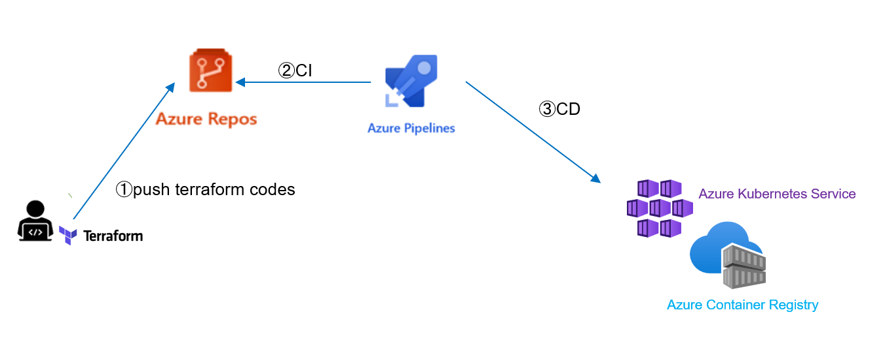
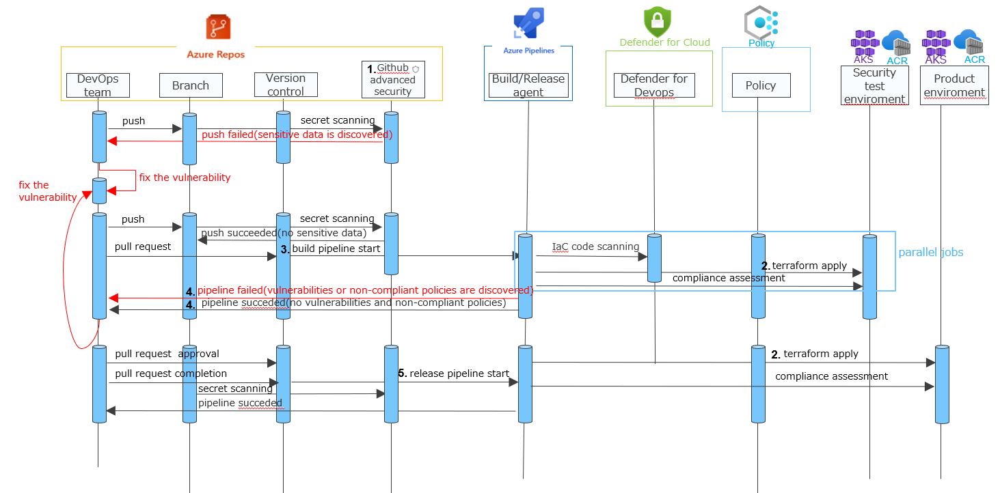
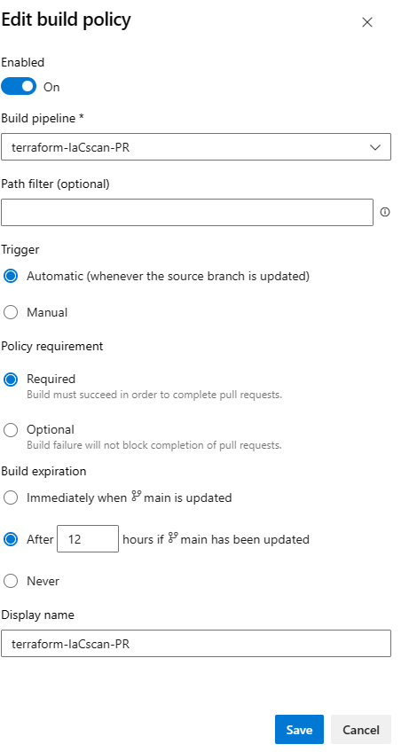
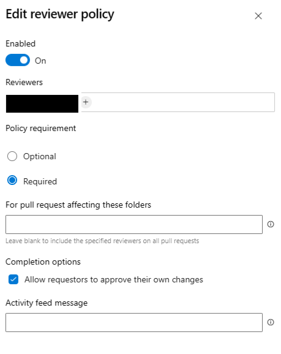

# Security testing for IaC(terraform) in a CI/CD with Azure DevOps Service
## Overview
This is about example of incorporating security testing for IaC(terraform) in a CI/CD with Azure DevOps Service
## CI/CD Environment Configuration
AKS and ACR are deployed using  Repos and Pipelines of Azure DevOps Service



## Services Used for Security Testing
### [Github advanced security](https://learn.microsoft.com/en-us/azure/devops/repos/security/configure-github-advanced-security-features?view=azure-devops&tabs=yaml)
This is integrated into Azure DevOps.<br>
It is used for Secret Scanning.
> [The secrets scanning (CredScan) tool within the Microsoft Security DevOps (MSDO) Extension for Azure DevOps has been deprecated and recommended to use GitHub Advanced Security for Azure DevOps](https://learn.microsoft.com/en-us/azure/defender-for-cloud/azure-devops-extension)

### [Azure Policy](https://learn.microsoft.com/en-us/azure/governance/policy/overview)
It is used for Compliance Assessment for IaC with [deployment gates](https://learn.microsoft.com/en-us/azure/devops/pipelines/release/approvals/gates?view=azure-devops)
### [Azure Defender for Devops](https://learn.microsoft.com/en-us/azure/defender-for-cloud/defender-for-devops-introduction)

It is used for Code Scanning for IaC

## Security testing for IaC(terraform) in a CI/CD
### Flow of Security Testing and Their Respective Explanations
Below is the sequence diagram for security testing.



#### 1. Github advanced security
To configure Secret Scanning, refer to [Set up secret scanning](https://learn.microsoft.com/en-us/azure/devops/repos/security/configure-github-advanced-security-features?view=azure-devops&tabs=yaml#set-up-secret-scanning)

#### 2. terraform apply
The Terraform code to be applyed can be found [here]()<br>
>For the explanation of the security testing process, I don't prepare any fixed code that passes the test.

Azure storages for remote-tfstate is required in advance.<br>
To create them, follow the steps below
```bash
#Create Storage for remote-tfstate of securitytest environment 
##Navigate to the ./codes/securitytest-tfstate directory
cd ./codes/securitytest-tfstate
## edit terraform.vars(if you need)
##Execute terraform init
terraform init
##Execute terraform apply
terraform apply

#Create Storage for remote-tfstate of product environment
##Navigate to the ./codes/product-tfstate directory
cd ./codes/product-tfstate
## edit terraform.vars(if you need)
##Execute terraform init
terraform init
##Execute terraform apply
terraform apply
```

#### 3. build pipeline start
Regarding the pipeline for IaC Code Scanning ,  refer to [azure-pipelines-IaCsecurityscan.yml](./codes/azure-pipelines-IaCsecurityscan.yml).
>You need to [set up Defender for DevOps](https://learn.microsoft.com/en-us/azure/defender-for-cloud/quickstart-onboard-devops) and [PR annotations](https://learn.microsoft.com/en-us/azure/defender-for-cloud/enable-pull-request-annotations#enable-pull-request-annotations-in-azure-devops) in advance. 

 Regarding the pipeline for the Compliance Assessment, refer to [the pipeline for the Compliance Assessment](./codes/compliance_assessment_pipeline.md).

#### 4. pipeline failed(vulnerabilities or non-compliant policies are discovered) and pipeline succeded(no vulnerabilities and non-compliant policies)
Branch policy prevent the completion of pull requests in case of IaC Code Scanning failures.



Reviewer policy prevents the completion of pull requests unless the specified approver approves them.
> It is not possible to set branch policies for the compliance assessment pipeline. Instead, it is managed through an approval process using this policy.




#### 5. release pipeline start
Regarding the pipeline, refer to [Release pipeline](./codes/release_pipeline.md).


This concludes the explanation.<br>
Continuous monitoring after deployment to the product environment, which is important as part of DevSecOps, is possible with Defender for Cloud (such as configuration error monitoring and threat monitoring). 