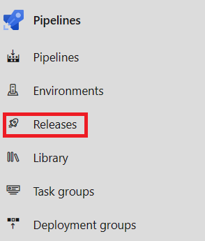
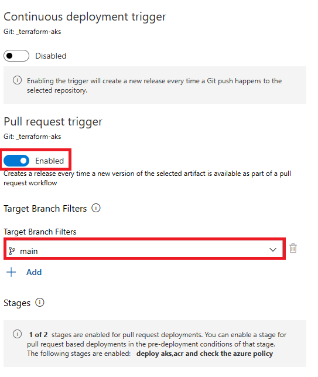
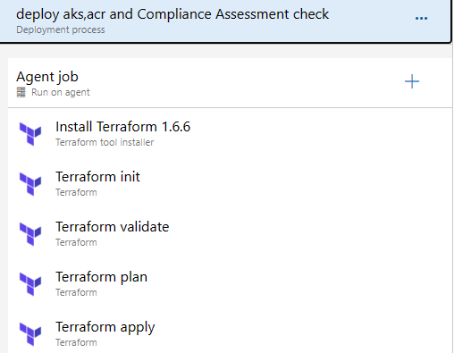
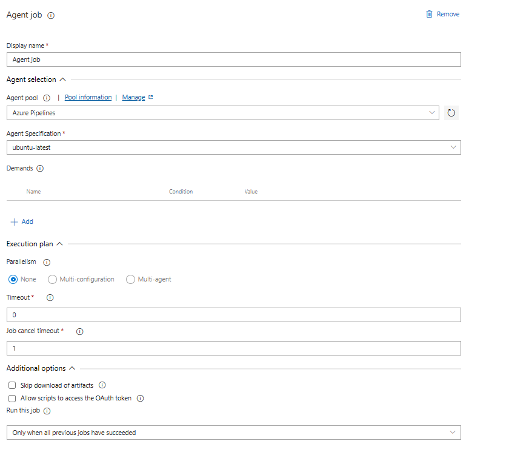
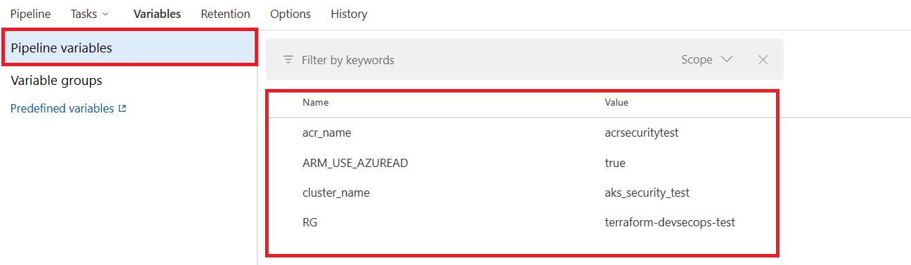
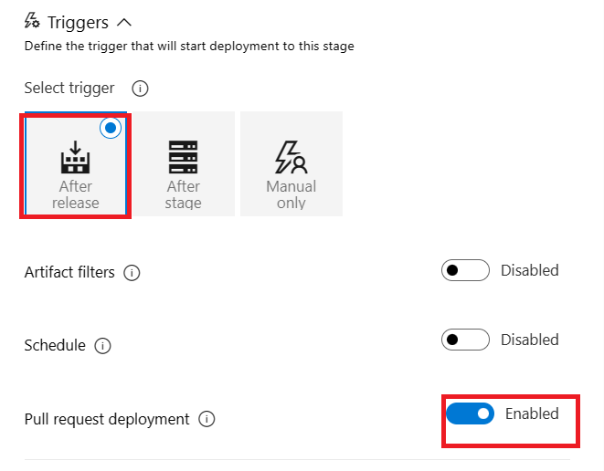
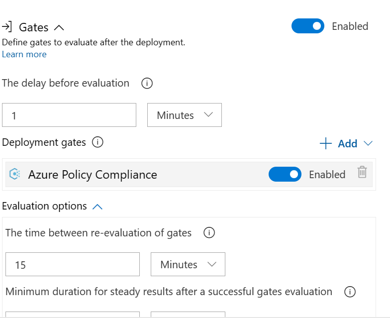
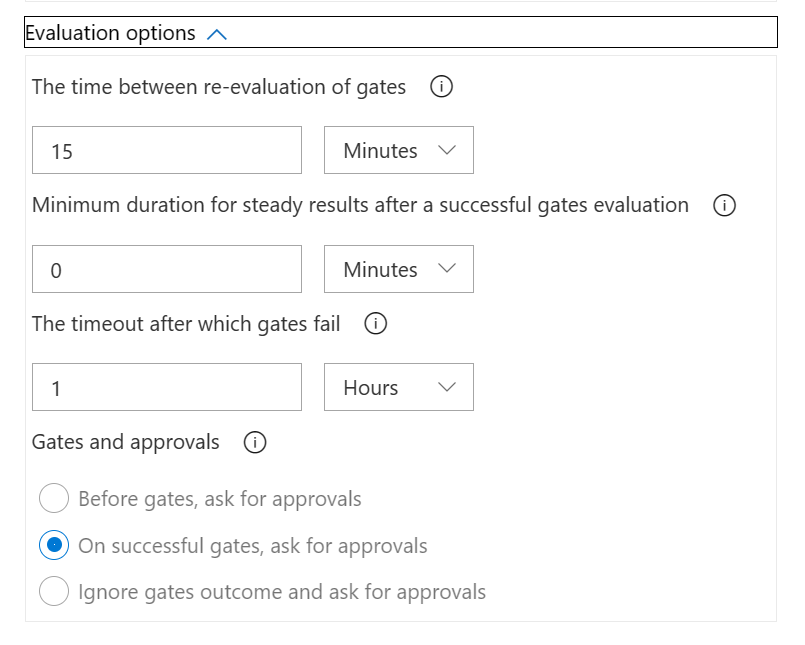

# The pipeline for the Compliance Assessment
With Releases for Azure Pipeline, create the pipeline for Compliance Assessment.


## Pull request trigger
Set pull request trigger in Artifacts.



## Stages
Set up Stages as shown below.

- Stage 



- Agent job



- Pipeline variables
> If you've editted file terraform.vars for remote-tfstate of securitytest environment, you need to change value of variable RG.



- Pipeline yaml for tasks
> Workload identity federation (OIDC) is recommended for service connection
```bash
variables:
  RG: '<resource group name>'
  cluster_name: 'aks_security_test'
  acr_name: 'acrsecuritytest'

steps:
- task: ms-devlabs.custom-terraform-tasks.custom-terraform-installer-task.TerraformInstaller@1
  displayName: 'Install Terraform 1.6.6'
  inputs:
    terraformVersion: 1.6.6
  timeoutInMinutes: 5

- task: ms-devlabs.custom-terraform-tasks.custom-terraform-release-task.TerraformTaskV4@4
  displayName: 'Terraform init'
  inputs:
    workingDirectory: '<working directory>'
    backendServiceArm: '<service connection>' #Workload identity federation (OIDC) is recommended 
    backendAzureRmResourceGroupName: '<resource group name>'
    backendAzureRmStorageAccountName: <StorageAccountName>
    backendAzureRmContainerName: 'azure-tfstate'
    backendAzureRmKey: terraform.tfstate
  timeoutInMinutes: 10

- task: ms-devlabs.custom-terraform-tasks.custom-terraform-release-task.TerraformTaskV4@4
  displayName: 'Terraform validate'
  inputs:
    command: validate
    workingDirectory: '<working directory>'
  timeoutInMinutes: 10

- task: ms-devlabs.custom-terraform-tasks.custom-terraform-release-task.TerraformTaskV4@4
  displayName: 'Terraform plan'
  inputs:
    command: plan
    workingDirectory: '<working directory>'
    commandOptions: '-var="resource_group_name=$(RG)" -var="aks_cluster_name=$(cluster_name)" -var="acr_name=$(acr_name)"'
    environmentServiceNameAzureRM: '<service connection>' #Workload identity federation (OIDC) is recommended 
  timeoutInMinutes: 10

- task: ms-devlabs.custom-terraform-tasks.custom-terraform-release-task.TerraformTaskV4@4
  displayName: 'Terraform apply'
  inputs:
    command: apply
    workingDirectory: '<working directory>'
    commandOptions: '-var="resource_group_name=$(RG)" -var="aks_cluster_name=$(cluster_name)" -var="acr_name=$(acr_name)"'
    environmentServiceNameAzureRM: '<service connection>' #Workload identity federation (OIDC) is recommended 
  timeoutInMinutes: 30

```
- Triggers



- Gates(Post-deployment conditions)
> This is Compliance Assessment setting.<br>
It is necessary to assign policies or initiatives (such as ASC Default) to the target scope beforehand.







